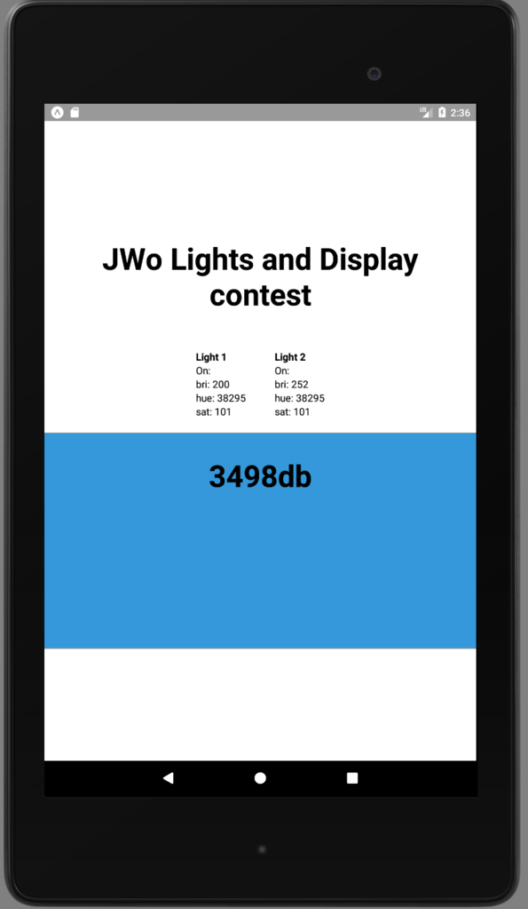

Kindle-Lights
=============

A React-Native app proof of concept that changes lights of a philips hue every 2
seconds.

Getting Started
---------------

1. Clone
2. Find the IP address of your HUE, update app
3. `npm install`
4. `npm run ios`

TODO:
----

* Make the lights auto-discover, or easily configurable
* Shine up the UI
* Let users press boxes to choose color
* Buzzfeed like quiz to select a rando-color

LICENSE
---------

Copyright 2017, Jesse Wolgamott, all rights reserved.

